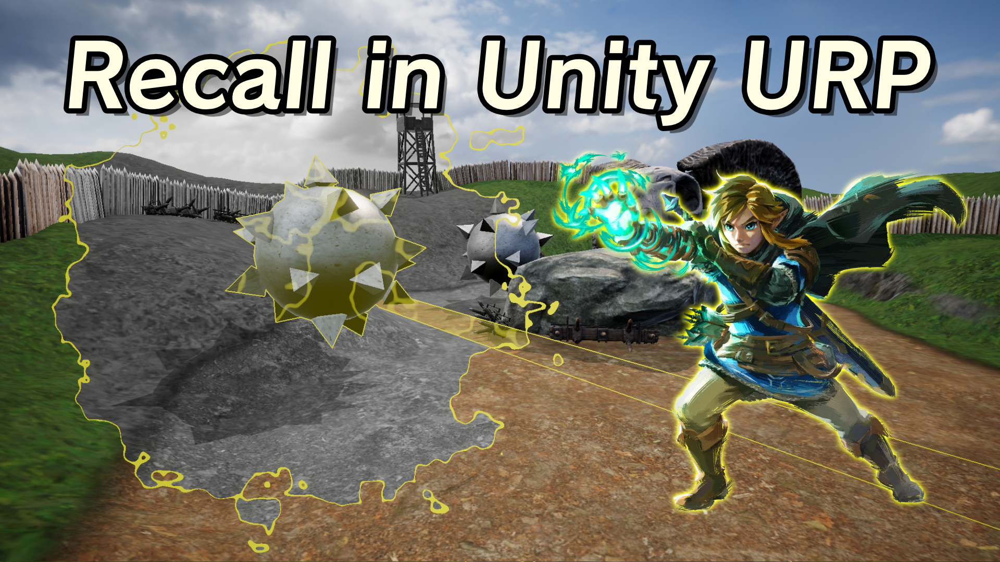

# Zelda: Tears of the Kingdom's Recall Rune in Unity URP

A recreation of the Recall rune's visuals using a post-processing shader in Unity 2022 for the Universal Render Pipeline.

## Overview

In *Tears of the Kingdom*, Link can use the Recall rune to reverse the flow of time for a single object. When it activates, the object and the path it took are outlined in yellow and a screen wipe effect turns most of the world greyscale. In this project, I made a post processing effect that masks out objects in certain Unity layers and draws the outlines and greyscale parts of the screen to recreate the effect seen in the game.

## Software

This project was created with Unity 2022.3.0f1 (LTS) and URP 14.0.7.

## Tutorials

This project is part of a tutorial which is available here:

- [YouTube](https://www.youtube.com/watch?v=ygSNqxOcPUA)
- [Article]() (Coming soon!)

## Authors

This project and the corresponding tutorials were created by Daniel Ilett.

## Release

This project was released on January 12th 2025.
